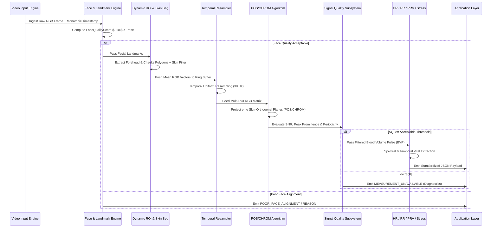

# AuraPulse System Specification & Architectural Blueprint

## 1. System Pipeline Overview

AuraPulse operates an edge-first, zero-cloud dependency pipeline that converts subtle skin reflectance fluctuations into calibrated physiological metrics.



---

## 2. Dynamic Framerate & Temporal Resampling

Consumer cameras rarely deliver static integer frame rates (e.g. 30.00 FPS). AuraPulse records monotonic nanosecond timestamps per frame:

$$\Delta t_k = t_k - t_{k-1}$$

The signal window $W(t)$ is re-interpolated onto a strictly uniform temporal grid $t_{\text{uniform}} \in [t_{\text{start}}, t_{\text{end}}]$ with step size $\Delta \tau = \frac{1}{f_s}$ where $f_s = 30.0\text{ Hz}$.

---

## 3. Standardized Output Schema

```json
{
  "heartRate": {
    "value": 74.2,
    "unit": "bpm",
    "confidence": 0.96,
    "signalQuality": 94.5,
    "methods": { "fft": 74.0, "welch": 74.2, "autocorr": 74.5, "peak_detection": 74.3 }
  },
  "respirationRate": {
    "value": 16.2,
    "unit": "breaths/min",
    "confidence": 0.92,
    "status": "VALID"
  },
  "pulseRateVariability": {
    "rmssd": 38.4,
    "sdnn": 41.2,
    "meanPpi": 808.6,
    "pnn50": 18.2,
    "sd1": 27.2,
    "sd2": 51.6,
    "unit": "ms",
    "confidence": 0.94,
    "label": "Pulse Rate Variability (PRV - Optical BVP)",
    "status": "VALID"
  },
  "stressIndex": {
    "score": 34.0,
    "level": "Low",
    "confidence": 0.94,
    "disclaimer": "Physiological autonomic indicator — not a medical or psychological diagnosis."
  },
  "signalQuality": 94.5,
  "qualityCategory": "Excellent",
  "measurementDuration": 30.0,
  "algorithmVersion": "0.1.0",
  "engine": "AuraPulse-Core",
  "validationStatus": "Research/Validated - On-Device Core"
}
```
